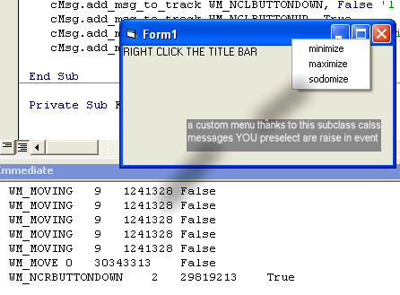



## Subclass dll  for dummies  \[very easy to use and understand\.  perfect for the beginner or intermedia

### Description

This is a wonderful subclassing .dll for anyone but particulary the beginner or intermediate programmer or anyone who doesn quite have a full handle on subclassing but still wants to be able to use the awesome Free power of it. This class is extremely simple and straightforward to use and contains 2 properties and 2 methods and 2 events and has a small help file as well. This subclassing project also allows you to not only intercept, but choose to discard or keep the message. A very simple example is given to show you the awesome potential and power subclassing has.
 
### More Info
 

             |
---                |---
**Submitted On**   |2005-01-26 02:41:16
**By**             |[Evan Toder](https://github.com/Planet-Source-Code/PSCIndex/blob/master/ByAuthor/evan-toder.md)
**Level**          |Intermediate
**User Rating**    |5.0 (40 globes from 8 users)
**Compatibility**  |VB 3\.0, VB 4\.0 \(16\-bit\), VB 5\.0, VB 6\.0
**Category**       |[Coding Standards](https://github.com/Planet-Source-Code/PSCIndex/blob/master/ByCategory/coding-standards__1-43.md)
**World**          |[Visual Basic](https://github.com/Planet-Source-Code/PSCIndex/blob/master/ByWorld/visual-basic.md)
**Archive File**   |[Subclass\_d1844301262005\.zip](https://github.com/Planet-Source-Code/evan-toder-subclass-dll-for-dummies-very-easy-to-use-and-understand-perfect-for-the-beginn__1-58504/archive/master.zip)

